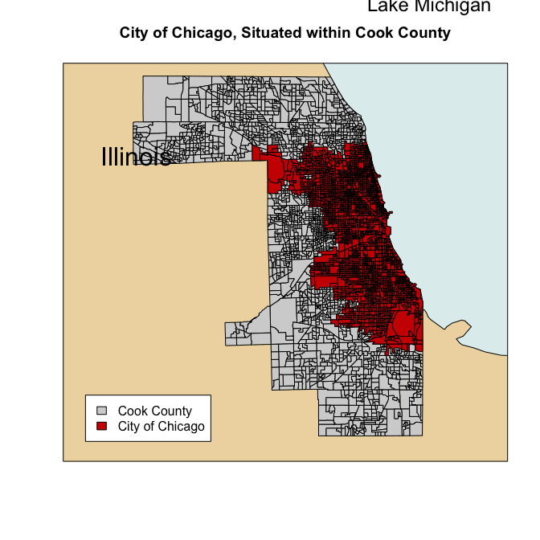
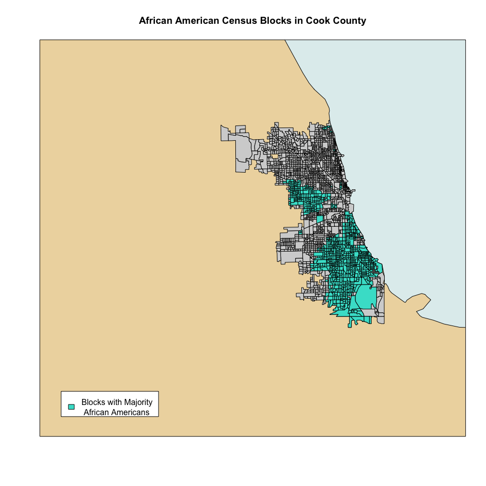
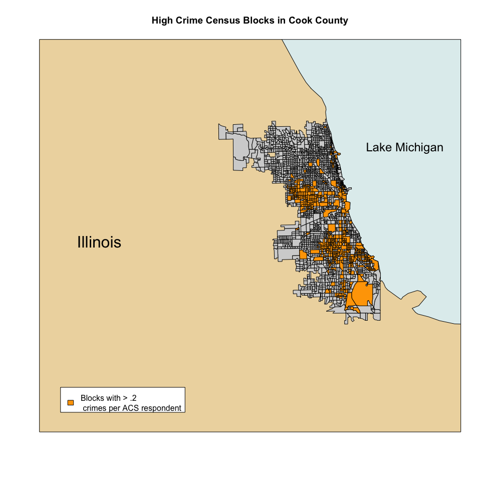
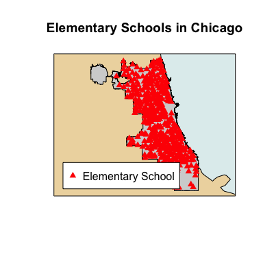
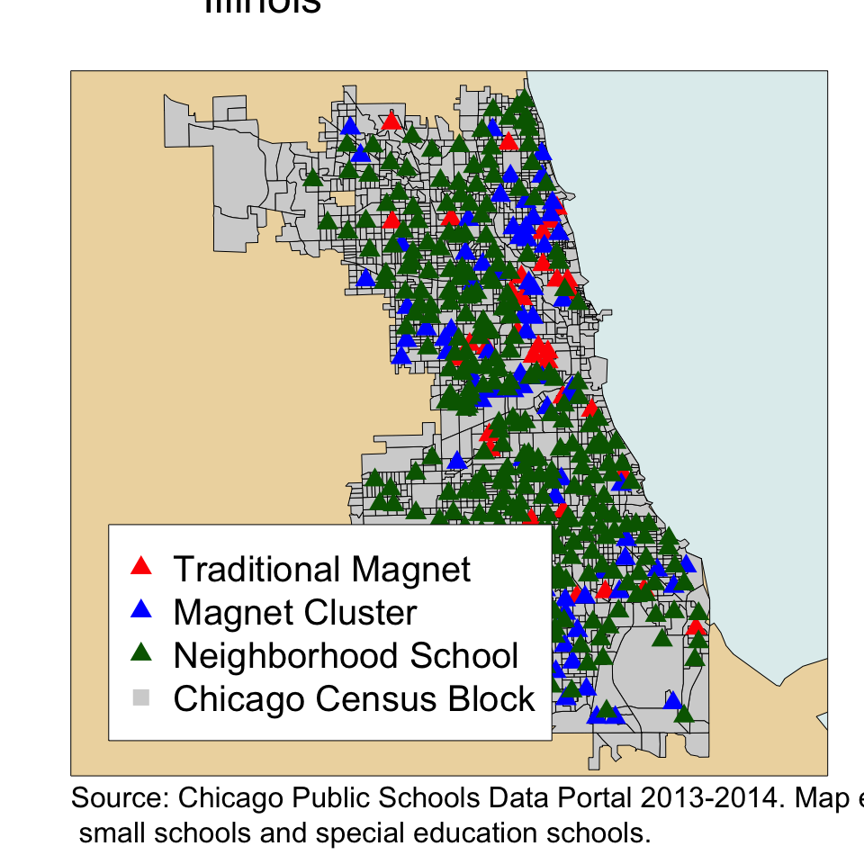
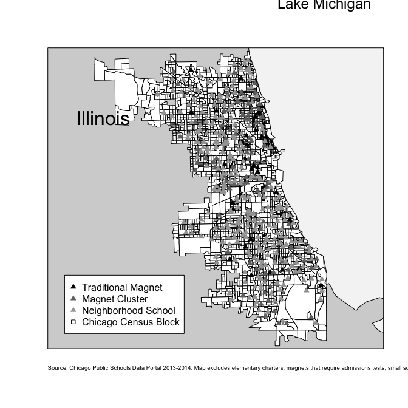

Magnet Analysis
================
Chad Evans

Built with 3.3.2. Last run on 2017-06-02.

-   [Set Up](#setup)
-   [Chicago Map](#chicagomap)
-   [Majority African American Blocks](#aamap)
-   [Crime in the City of Chicago](#crimemap)
-   [Elementary Schools in Chicago](#schoolsmap)
-   [Chicago blocks on Lake Michigan](#mich)
-   [Descriptive Statistics](#descriptives)
-   [Analysis](#analysis)

Set Up
======

First, set up the environment: read in the libraries, indicate the directories, read in and clean the data.

``` r
USA.shp <- readOGR(dsn = datdir2, layer = "cb_2014_us_nation_5m")
Il.shp <- readOGR(dsn = datdir, layer = "cb_2014_17_bg_500k")
cook.shp=Il.shp[Il.shp$COUNTYFP=="031",]
chi.shp=readOGR(dsn = datdir3, layer = "City_Boundary")
water.shp=readOGR(dsn = datdir4, layer = "ne_10m_lakes")
pop=read_csv(file.path(datdir5, "ACS_13_5YR_B01003_with_ann.csv"), skip = 1)
black=read_csv(file.path(datdir5, "ACS_13_5YR_B02009_with_ann.csv"), skip = 1)
traveltime=read_csv(file.path(datdir5, "ACS_13_5YR_B08303_with_ann.csv"), skip=1)
medrooms=read_csv(file.path(datdir5, "ACS_13_5YR_B25018_with_ann.csv"), skip=1, na = c("**","-","***","9.0+"))
homeage=read_csv(file.path(datdir5, "ACS_13_5YR_B25034_with_ann.csv"), skip=1)
medincome=read_csv(file.path(datdir5, "ACS_13_5YR_B19013_with_ann.csv"), skip=1, na = c("**","-","***","250,000+"))
medvalue=read_csv(file.path(datdir5,"ACS_13_5YR_B25077_with_ann.csv"),skip=1, na = c("-","1,000,000+"))
crimedata=read_csv(file.path(datdir6,"Crimedata.csv"))
schooldata=read_csv(file.path(datdir7, "schooldata.csv")) %>% mutate_if(is.character, factor)
```

Now project all the shapefiles to the same coordinate system.

``` r
Il.shp <- spTransform(Il.shp, CRS=CRS("+proj=longlat +datum=WGS84")) 
cook.shp <- spTransform(cook.shp, CRS=CRS("+proj=longlat +datum=WGS84")) 
chi.shp <- spTransform(chi.shp, CRS=CRS("+proj=longlat +datum=WGS84")) 
water.shp <- spTransform(water.shp, CRS=CRS("+proj=longlat +datum=WGS84")) 
```

Use spatial joins to create chicago city block (tracts) shapefile.

``` r
d <- over(cook.shp, chi.shp[,"OBJECTID"]) # need dependent projections correct
cook.shp$bcode <- d$OBJECTID
chiblocks.shp<-cook.shp[!is.na(cook.shp$bcode)=="TRUE",]
```

Clean up files and reduce to necessary files.

``` r
medrooms$`Estimate; Median number of rooms`[c(1933,1934,1936:1941,1943,1944)]<-9.0 # hack to resolve 9.0+ character, imposes ceiling of 9 rooms.
medincome$`Estimate; Median household income in the past 12 months (in 2013 inflation-adjusted dollars)`[c(1933,1937,1944,1951,1952)]<-250000 # hack to resolve 250,000+, ceiling imposed on median income of 250k.
medvalue$`Estimate; Median value (dollars)`[c(321,398,1075,1933,1934,1944,1945,1948,1949,1952,1954,1972,3071)]<-1000000 # hack to resolve 1,000,000+, ceiling imposed on median value of 1m.

pop <- pop  %>% rename(POP = `Estimate; Total`) %>% select(Id,POP)
black <- black %>% rename(BLACK = `Estimate; Total:`) %>% select(Id,BLACK)
pctblack<-inner_join(pop,black) %>% mutate(PCTBLACK = BLACK/POP)
traveltime<- traveltime %>% mutate(PCT30MIN = (`Estimate; Total: - 30 to 34 minutes`+`Estimate; Total: - 35 to 39 minutes`+`Estimate; Total: - 40 to 44 minutes`+`Estimate; Total: - 45 to 59 minutes`+`Estimate; Total: - 60 to 89 minutes`+`Estimate; Total: - 90 or more minutes`)/`Estimate; Total:`) %>% select(Id,PCT30MIN)
medrooms<- medrooms %>% rename(MEDROOMS = `Estimate; Median number of rooms`) %>% select(Id,MEDROOMS)
homeage<-homeage %>% mutate(PCTHOMEAGE40 = `Estimate; Total: - Built 1939 or earlier`/`Estimate; Total:`) %>% select(Id,PCTHOMEAGE40)
medincome<- medincome %>% rename(MEDINCOME = `Estimate; Median household income in the past 12 months (in 2013 inflation-adjusted dollars)`) %>% select(Id,MEDINCOME)
medvalue<- medvalue %>% rename(MEDVALUE = `Estimate; Median value (dollars)`) %>% select(Id,MEDVALUE)
crimedata<-crimedata %>% select(Longitude,Latitude) %>% na.omit() # 1926 or 0.006288015 or .01% missing data
crimedata$COUNT=1 # One incident at each unique longitude and latitude combo
```

Merge all necessary columns into Tidy-formated data frame.

``` r
dfs_list <- list(pctblack,traveltime,medrooms,homeage, medincome, medvalue)
df<-Reduce(left_join, dfs_list)
rm(pctblack,traveltime,medrooms,homeage, medincome, medvalue)

chiblocks.shp@data <- chiblocks.shp@data %>% as_data_frame %>% rename(Id = `AFFGEOID`) 
chiblocks.shp@data <- left_join(chiblocks.shp@data, df)

crime.shp <- SpatialPointsDataFrame(coords = crimedata[, c("Longitude","Latitude")], data = data.frame(values = crimedata$COUNT))
proj4string(crime.shp) <- CRS("+proj=longlat +datum=WGS84")
crime.shp@data <- crime.shp@data %>% as_data_frame()
```

Exploratory Analysis
====================

Chicago Blocks Map
------------------

Let's make sure all the spatial joins were done properly. First, let's plot all the geographies: USA, Il, cook, and city of chicago.

``` r
plot(USA.shp, ylim=c(41.6, 42), xlim=c(-88.4, -87.35),col = "wheat2",bg="azure2", main="City of Chicago, Situated within Cook County")
plot(cook.shp, add=T,col="lightgrey")
plot(chiblocks.shp, add=T, col="red3")
legend("bottomleft", inset=.05, c("Cook County","City of Chicago"), fill=c("lightgrey","red3"), horiz=FALSE, bg="white")  
```



Majority African American Blocks
--------------------------------

Let's highlight the areas of Chicago that are majority African American. The southside and westside of Chicago should have majority black residents.

``` r
plot(USA.shp, ylim=c(41.6, 42), xlim=c(-88.4, -87.35),col = "wheat2",bg="azure2", main="African American Census Blocks in Cook County")
box()
plot(chiblocks.shp, add=T, col="lightgrey")
pctblack.shp=chiblocks.shp[!is.na(chiblocks.shp$PCTBLACK),]
sel <- pctblack.shp$PCTBLACK > 0.50
plot(pctblack.shp[sel, ], col = "turquoise", add = TRUE) # add selected zones to map
legend("bottomleft", inset=.05, c("Blocks with Majority \n African Americans"), fill=c("turquoise"), horiz=FALSE, bg="white") 
```



This map is consistent with expectations.

Crime in the City of Chicago
----------------------------

Our analysis needs to factor in crime rates across Chicago city blocks. To calculate crime rates, we spatially join crime incidents to block level geographies. Then we sum up the number of crime incidents and divide by a measure of the population in each black. Using ACS data, I divided by the number of respondents in each tract. This is not a traditional crime rate as I did not scale up to an estimate of the population in each tract. However, this does produce an equally good measure of crime prevalence that differs only by the sample weight.

``` r
n_crimes <- over(chiblocks.shp, crime.shp, fn=sum) %>% as_data_frame()
n_crimes[is.na(n_crimes)]<-0 # 140 blocks (of 2329) have no crimes reported.  I substiute 0 for those NAs
chiblocks.shp@data[, "COUNTS"] <- n_crimes
chiblocks.shp@data <- chiblocks.shp@data %>% mutate(PERCAPCRIME = COUNTS/POP) # Incidents per population
chiblocks.shp$PERCAPCRIME[chiblocks.shp$PERCAPCRIME>10]<-0 # Because these blocks have 0 population or were not counted by ACS, resulting in -inf, set to zero
```

Now let's plot the high crime areas of Chicago. I expect there to be higher crime in the downtown and south and west side. The periphery, particularly the north, should have lower crime rates.

``` r
plot(USA.shp, ylim=c(41.6, 42), xlim=c(-88.4, -87.35),col = "wheat2",bg="azure2", main="High Crime Census Blocks in Cook County")
box()
plot(chiblocks.shp, add=T,col="lightgrey")
plot(chiblocks.shp[chiblocks.shp$PERCAPCRIME > .2, ], col = "orange", add = TRUE) # add selected zones to map
legend("bottomleft", inset=.05, c("Blocks with > .2 \n crimes per ACS respondent"), fill=c("orange"), horiz=FALSE, bg="white") 
```



Elementary Schools in Chicago
-----------------------------

First, create a shapefile based on the geographical location of each school. Project this file into the working coordinate system.

``` r
schools.shp <- SpatialPointsDataFrame(coords = schooldata[, c("Longitude","Latitude")],data = schooldata)
proj4string(schools.shp) <- CRS("+proj=longlat +datum=WGS84")
```

Now, let's plot those schools over the city of chicago base file.

``` r
plot(USA.shp, ylim=c(41.64454, 42.02304), xlim=c(-87.94011, -87.52414),col = "wheat2",bg="azure2", main="Elementary Schools in Chicago")
box()
plot(chiblocks.shp, add=T, col="lightgrey")
plot(schools.shp, pch = 17, add=T, col="red")
legend("bottomleft", inset=.05, pch = 17, c("Elementary School"), col="red", horiz=FALSE, bg="white")   
```



``` r
plot(USA.shp, ylim=c(41.63454, 42.02304), xlim=c(-87.94011, -87.52414),col = "wheat2",bg="azure2",)
box()
plot(chiblocks.shp, add=T, col="lightgrey")
magnets.shp<-schools.shp[schools.shp$Type2=="Magnet",]
clusters.shp<-schools.shp[schools.shp$Type2=="Magnet Cluster",]
openenroll.shp<-schools.shp[schools.shp$Type2=="Open Enrollment", ]
plot(magnets.shp, pch = 17, add=T, col="red",cex=1)
plot(clusters.shp, pch = 17, add=T, col="blue",cex=1)
plot(openenroll.shp, pch = 17, add=T, col="darkgreen",cex=1)
legend("bottomleft", inset=.05, pch = c(17,17,17,15), c("Traditional Magnet","Magnet Cluster","Neighborhood School", "Chicago Census Block"), col=c("red","blue","darkgreen","lightgrey"), horiz=FALSE, cex=1)   
mtext("Lake Michigan             ",side=1,line=-75,adj=1,cex=1.5,col="darkblue")
mtext("Source: Chicago Public Schools Data Portal 2013-2014. Map excludes elementary charters, magnets that require admissions tests, \n small schools and special education schools.",side=1,line=3,adj=0,cex=2,col="black")
mtext("           Illinois",side=1,line=-45,adj=0,cex=3,col="black")
```



``` r
plot(USA.shp, ylim=c(41.63454, 42.02304), xlim=c(-87.94011, -87.52414),col = "lightgrey",bg="gray96")
box()
plot(chiblocks.shp, add=T, col="white")
magnets.shp<-schools.shp[schools.shp$Type2=="Magnet",]
clusters.shp<-schools.shp[schools.shp$Type2=="Magnet Cluster",]
openenroll.shp<-schools.shp[schools.shp$Type2=="Open Enrollment", ]
plot(magnets.shp, pch = 17, add=T, col="black",cex=1)
plot(clusters.shp, pch = 17, add=T, col="gray44",cex=1)
plot(openenroll.shp, pch = 17, add=T, col="grey64",cex=1)
legend("bottomleft", inset=.05, pch = c(17,17,17,22), c("Traditional Magnet","Magnet Cluster","Neighborhood School", "Chicago Census Block"), col=c("black","gray44","gray64","black"), horiz=FALSE, cex=1.5)   
mtext("Lake Michigan             ",side=1,line=-75,adj=1,cex=2.5,col="darkblue")
mtext("Source: Chicago Public Schools Data Portal 2013-2014. Map excludes elementary charters, magnets that require admissions tests, \n small schools and special education schools.",side=1,line=3,adj=0,cex=2,col="black")
mtext("           Illinois",side=1,line=-45,adj=0,cex=3,col="black")
```



Chicago blocks on Lake Michigan
-------------------------------

``` r
ShapeFile.Dissolved<-gUnionCascaded(chiblocks.shp)
x<-gRelate(chiblocks.shp, ShapeFile.Dissolved, byid= TRUE)
poly.border<-which(x %in% c("2FF11F212"))
#library(raster)  # crop from raster() requires select() from base
michblocks.shp <- raster::crop(chiblocks.shp[poly.border,], raster::extent(-87.673, -87.525, 41.70, 42.25))
michblocks.shp$MICH<-1
chiblocks.shp@data$MICH<-0
rows <- row.names(michblocks.shp@data)
chiblocks.shp@data[rows, "MICH"] <- michblocks.shp@data$MICH
spjoin <- over(schools.shp, chiblocks.shp) %>% as_data_frame() 
data=bind_cols(schools.shp@data, spjoin)
```

There are no schools located in neighborhoods that directly border Lake Michigan

Let's change the reference category of the schools to "Open Enrollment" and only examine the three school types of the study (i.e., Open Enrollment, Magnet Cluster and Tradititional Magnet)

``` r
data$Type=relevel(data$Type, ref="Open Enrollment")
data$Type2=relevel(data$Type2, ref="Open Enrollment")
data<- data %>% filter(Type2 == "Open Enrollment" | Type2 == "Magnet" | Type2 == "Magnet Cluster") # removes schools requiring testing, small, special ed and charter schools
```

Let's center variables and calculate the quadratic value, when required by the analysis.

``` r
data <- data %>% mutate(CPERCAPCRIME= PERCAPCRIME-mean(PERCAPCRIME,na.rm=T), CLOGPCT30MIN=log(PCT30MIN)-mean(log(PCT30MIN), na.rm=T), CPCTHOMEAGE40=PCTHOMEAGE40-mean(PCTHOMEAGE40,na.rm=T), CLOGMEDINCOME=log(MEDINCOME)-mean(log(MEDINCOME), na.rm=T), CREAD=ISAT.Exceeding.Reading...-mean(ISAT.Exceeding.Reading...,na.rm=T), CMATH=ISAT.Exceeding.Math..-mean(ISAT.Exceeding.Math..,na.rm=T), CBk=PCTBLACK - mean(PCTBLACK, na.rm=T), CMEDROOMS=MEDROOMS-mean(MEDROOMS, na.rm=T)) %>% mutate(CBk2=CBk*CBk, CMEDROOMS2=CMEDROOMS*CMEDROOMS)
```

Missing Data
------------

How much missingness?

``` r
miss_pct <- map_dbl(data, function(x) { round((sum(is.na(x)) / length(x)) * 100, 1) })
miss_pct <- miss_pct[miss_pct > 0]
data.frame(miss=miss_pct, var=names(miss_pct), row.names=NULL) %>%
ggplot(aes(x=reorder(var, -miss), y=miss)) +
geom_bar(stat='identity', fill='red') +
labs(x='', y='% missing', title='Percent missing data by feature') +
theme(axis.text.x=element_text(angle=90, hjust=1))
```

 Of 48 columns, 20 have missing values. The percentage of values missing ranges from 0.5% in PCTBLACK to 4.1% in MEDVALUE. Very little missing data. Listwise deletion will work fine.

Descriptive Statistics
----------------------

Correlation Plot

``` r
data %>% 
  select(MEDVALUE,CPERCAPCRIME,CMEDROOMS,CMEDROOMS2,CLOGMEDINCOME,CLOGPCT30MIN,CPCTHOMEAGE40,CBk,CBk2,CREAD,CMATH) %>% 
  cor(use = "pairwise.complete.obs") %>% 
  corrplot()
```

 Variables seem to be correlated as expected.

Correlation between school types and educational quality.

``` r
data %>% mutate(Cluster=data$Type2=="Magnet Cluster", Magnet=data$Type2=="Magnet") %>% select(Read=ISAT.Exceeding.Reading...,Math=ISAT.Exceeding.Math.., Cluster, Magnet) %>% cor(use = "pairwise.complete.obs")
```

    ##               Read       Math     Cluster     Magnet
    ## Read    1.00000000 0.93181068  0.01262809  0.3541225
    ## Math    0.93181068 1.00000000  0.01710154  0.3341444
    ## Cluster 0.01262809 0.01710154  1.00000000 -0.1642822
    ## Magnet  0.35412255 0.33414443 -0.16428219  1.0000000

High correlation between magnet status and measures of educational quality. There is virtually no correlation of magnet cluster with reading or math scores.

### Descriptive Statistics

``` r
Table<-data %>% 
  group_by(Type2) %>%
  select(MEDVALUE,PERCAPCRIME,MEDROOMS,MEDINCOME,PCT30MIN,PCTHOMEAGE40,PCTBLACK,ISAT.Exceeding.Reading...,ISAT.Exceeding.Math..) %>% 
  summarise_each(funs(mean(., na.rm = TRUE))) %>% 
  select(-Type2) %>% 
  t() %>%
  round(digits = 2)
colnames(Table) = c("Open Enrollment","Magnet","Magnet Cluster")
row.names(Table)<-c("Average Median Home Value","Crime Rate","Median # of Rooms","Median Income","Proportion Traveling >30 Minutes to Work","Proportion of Homes Built Before 1940","Proportion Black","Proportion Exceeding ISAT Reading","Proportion Exceeding ISAT Math")
kable(Table)
```

|                                             |  Open Enrollment|     Magnet|  Magnet Cluster|
|---------------------------------------------|----------------:|----------:|---------------:|
| Average Median Home Value                   |        209308.37|  321000.00|       252610.81|
| Crime Rate                                  |             0.15|       0.13|            0.15|
| Median \# of Rooms                          |             5.18|       4.93|            4.97|
| Median Income                               |         42673.44|   52777.42|        47789.10|
| Proportion Traveling &gt;30 Minutes to Work |             0.59|       0.53|            0.61|
| Proportion of Homes Built Before 1940       |             0.50|       0.46|            0.52|
| Proportion Black                            |             0.46|       0.39|            0.45|
| Proportion Exceeding ISAT Reading           |            12.81|      27.29|           14.88|
| Proportion Exceeding ISAT Math              |            17.11|      32.77|           19.51|

Exploratory Analyses
--------------------

``` r
mod=lm(log(MEDVALUE)~Specialty+PERCAPCRIME+CBk+CBk2+log(PCT30MIN)+CMEDROOMS+CMEDROOMS2+PCTHOMEAGE40+log(MEDINCOME), data=data)

# When Interaction Term is included
mod=lm(log(MEDVALUE)~Type2+CPERCAPCRIME+CMEDROOMS+CMEDROOMS2+CLOGMEDINCOME+CLOGPCT30MIN+CPCTHOMEAGE40+CBk+CBk2+CREAD+CREAD*Type2, data=data)
mod=lm(log(MEDVALUE)~Type2+CPERCAPCRIME+CMEDROOMS+CMEDROOMS2+CLOGMEDINCOME+CLOGPCT30MIN+CPCTHOMEAGE40+CBk+CBk2+CMATH+CMATH*Type2, data=data)
```

Analysis
--------

### Table 2

``` r
mod0<-lm(log(MEDVALUE)~Magnet, data=data)
mod1<-lm(log(MEDVALUE)~Magnet+CPERCAPCRIME+CMEDROOMS+CMEDROOMS2+CLOGMEDINCOME+CLOGPCT30MIN+CPCTHOMEAGE40+CBk+CBk2, data=data)

Varlist<-c("Intercept", "Magnet (ref=Neighborhood Schools)", "Crime Rate","Median Number of Rooms","Median Number of Rooms^2", "log(Median Income)","log(Proportion Commuting > 30 min)","Proportion of Homes Build before 1940","Proportion Black","Proportion Black^2")

coefs01<-list(summary(mod0)$coefficients[,-3], summary(mod1)$coefficients[,-3])

n <- max(sapply(coefs01, nrow)) 
Table2<-do.call(cbind, lapply(coefs01, function (x) {
  rbind(x, matrix(, n-nrow(x), ncol(x)))
})) 
row.names(Table2)<-Varlist
colnames(Table2)[c(3,6)]<-c("p-value","p-value")
kable(round(Table2,2))
```

|                                       |  Estimate|  Std. Error|  p-value|  Estimate|  Std. Error|  p-value|
|---------------------------------------|---------:|-----------:|--------:|---------:|-----------:|--------:|
| Intercept                             |     12.15|        0.03|        0|     12.09|        0.06|     0.00|
| Magnet (ref=Neighborhood Schools)     |      0.21|        0.05|        0|      0.10|        0.04|     0.02|
| Crime Rate                            |        NA|          NA|       NA|     -0.48|        0.20|     0.02|
| Median Number of Rooms                |        NA|          NA|       NA|     -0.13|        0.03|     0.00|
| Median Number of Rooms^2              |        NA|          NA|       NA|      0.04|        0.02|     0.00|
| log(Median Income)                    |        NA|          NA|       NA|      0.37|        0.05|     0.00|
| log(Proportion Commuting &gt; 30 min) |        NA|          NA|       NA|     -0.39|        0.08|     0.00|
| Proportion of Homes Build before 1940 |        NA|          NA|       NA|      0.13|        0.09|     0.13|
| Proportion Black                      |        NA|          NA|       NA|     -0.20|        0.07|     0.00|
| Proportion Black^2                    |        NA|          NA|       NA|      0.27|        0.26|     0.30|

### Table 3

``` r
mod2<-lm(log(MEDVALUE)~Type2+CPERCAPCRIME+CMEDROOMS+CMEDROOMS2+CLOGMEDINCOME+CLOGPCT30MIN+CPCTHOMEAGE40+CBk+CBk2, data=data)
mod3<-lm(log(MEDVALUE)~Type2+CPERCAPCRIME+CMEDROOMS+CMEDROOMS2+CLOGMEDINCOME+CLOGPCT30MIN+CPCTHOMEAGE40+CBk+CBk2+CREAD+CMATH, data=data)

Varlist<-c("Intercept", "Magnet (ref=Neighborhood Schools)","Magnet Cluster (ref=Neighborhood Schools)","Crime Rate","Median Number of Rooms","Median Number of Rooms^2", "log(Median Income)","log(Proportion Commuting > 30 min)","Proportion of Homes Build before 1940","Proportion Black","Proportion Black^2","Stand. Reading Score","Stand. Math Score")

coefs23<-list(summary(mod2)$coefficients[,-3], summary(mod3)$coefficients[,-3])

n <- max(sapply(coefs23, nrow)) 
Table3<-do.call(cbind, lapply(coefs23, function (x) {
  rbind(x, matrix(, n-nrow(x), ncol(x)))
})) 
row.names(Table3)<-Varlist
colnames(Table3)[c(3,6)]<-c("p-value","p-value")
kable(round(Table3,2))
```

|                                           |  Estimate|  Std. Error|  p-value|  Estimate|  Std. Error|  p-value|
|-------------------------------------------|---------:|-----------:|--------:|---------:|-----------:|--------:|
| Intercept                                 |     12.09|        0.06|     0.00|     12.14|        0.06|     0.00|
| Magnet (ref=Neighborhood Schools)         |      0.19|        0.07|     0.00|      0.02|        0.07|     0.75|
| Magnet Cluster (ref=Neighborhood Schools) |      0.06|        0.05|     0.23|      0.05|        0.05|     0.30|
| Crime Rate                                |     -0.48|        0.20|     0.02|     -0.43|        0.20|     0.03|
| Median Number of Rooms                    |     -0.12|        0.03|     0.00|     -0.12|        0.03|     0.00|
| Median Number of Rooms^2                  |      0.04|        0.02|     0.00|      0.03|        0.01|     0.04|
| log(Median Income)                        |      0.38|        0.05|     0.00|      0.28|        0.05|     0.00|
| log(Proportion Commuting &gt; 30 min)     |     -0.37|        0.08|     0.00|     -0.35|        0.07|     0.00|
| Proportion of Homes Build before 1940     |      0.15|        0.09|     0.09|      0.21|        0.08|     0.01|
| Proportion Black                          |     -0.20|        0.07|     0.00|     -0.13|        0.07|     0.08|
| Proportion Black^2                        |      0.29|        0.26|     0.27|      0.14|        0.26|     0.58|
| Stand. Reading Score                      |        NA|          NA|       NA|      0.02|        0.00|     0.00|
| Stand. Math Score                         |        NA|          NA|       NA|      0.00|        0.00|     0.27|

### Sensitivity Test

We can evaluate the sensitivity of our results by only looking at the schools that had not closed their doors since last year. Results do not change substantially.

``` r
data2 <- data %>% filter(Closed==0)
```
